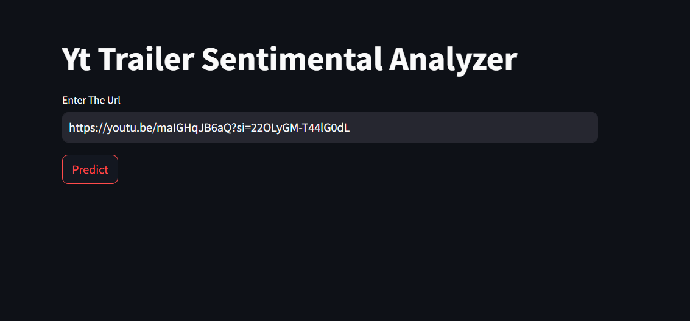
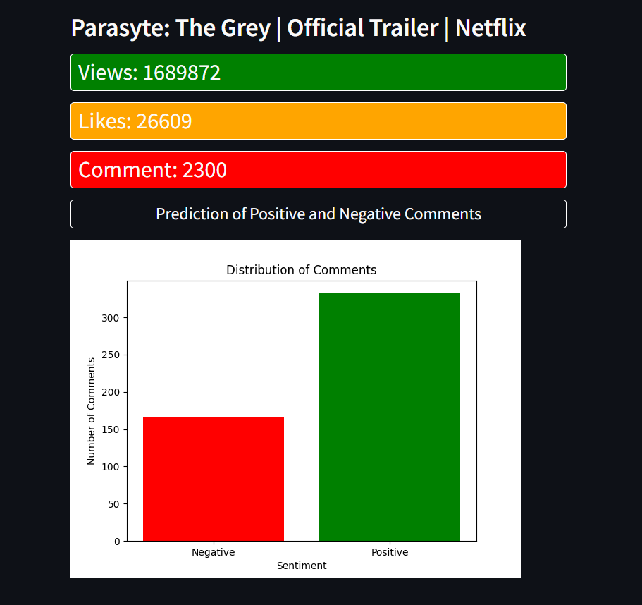

# YT Trailer Sentiment Analyzer

## Introduction
YT Trailer Sentiment Analyzer is a comprehensive tool that analyzes YouTube movie trailer comments to predict the number of positive and negative comments. It also retrieves and displays detailed statistics about the video, including the number of likes, views, comments, and the title of the video.

## Features
- Retrieve video title, likes, views, and comments count.
- Predict the number of positive and negative comments.
- Analyze sentiment of YouTube movie trailer comments.

## Screenshots

### Homepage


### Details Page


## Installation

To get started with this project, clone the repository and install the required dependencies:

```bash
git clone https://github.com/nikitbisht/YT-Trailer-Sentiment-Analyzer.git
cd yt-trailer-sentiment-analyzer
pip install -r requirements.txt
streamlit run app.py


## Contributing

Contributions are welcome! Please follow these guidelines when contributing to the project:

- If you encounter a bug or would like to request a new feature, please open an issue on GitHub.
- If you would like to contribute code changes, please fork the repository and submit a pull request.
- Before submitting a pull request, make sure your code follows the project's coding style and conventions.
- When submitting a pull request, provide a clear description of the changes and any relevant information.

## License

This project is licensed under the MIT License - see the [LICENSE](LICENSE) file for details.
